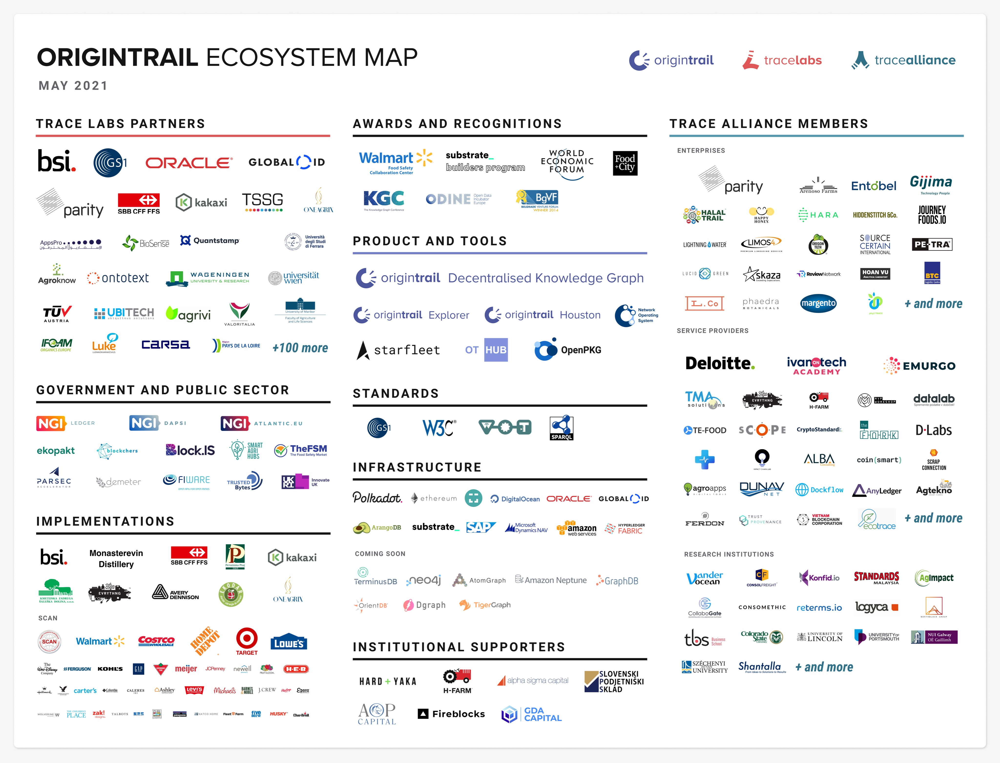

# Introduction

OriginTrail is an **open protocol** that blends the power of **blockchain** technology and **knowledge graphs** to revolutionize the way **data** is managed, stored, and utilized in **Artificial Intelligence** and other applications.&#x20;

In other words, it is the combination of two technologies:

1. ****[**Knowledge Graphs**](https://www.ontotext.com/knowledgehub/fundamentals/what-is-a-knowledge-graph/) – which are advanced databases used by big tech companies such as Google, Amazon, Facebook, Twitter, Uber to derive value from user data.
2. **Blockchain** – which enables decentralization, meaning the database is not controlled by for-profit companies.


#### This combination creates a decentralized database which will serve as the backbone for an open, neutral and transparent application of **Artificial Intelligence**.&#x20;


By giving users back control of their data, OriginTrail's Decentralized Knowledge Graph (DKG) offers a level playing field where data is controlled by the users and not monopolized by for-profit companies.&#x20;

## Data and Artificial Intelligence


**Metcalfe's Law** states that the **value of a network** grows exponentially with the **number of its users**. This implies that **connectivity** is the real source of value in a network.


In other words, **Data** becomes exponentially more valuable when it's connected. Currently, a limited number of corporations control the majority of data, leaving those who are wary of sharing their data due to **trust concerns** with less valuable data. **The Decentralized Knowledge Graph eliminates this trust barrier** by creating an open, transparent network that enables all individuals to share and connect their data while maintaining ownership of their data.

The DKG becomes the provider of limitless data where all centralized or decentralized AI technologies, such as **Google's Bard**, **Microsoft's ChatGPT**, **Fetch AI** and **Bittensor**, can be linked together and built upon, resulting in a more transparent, interconnected and valuable ecosystem.


#### The Decentralized Knowledge Graph is the portal of humanity's data to the Semantic Web and Artificial Intelligence. In other words, the core team of OriginTrail is building the decentralized ** **<mark style="color:blue;">**Google for Web3**</mark>** and the **<mark style="color:blue;">**Brain of AI**</mark>**.**&#x20;


## Dr. Bob Metcalfe

A word from the Father of Ethernet, Inventor of Metcalfe's Law, advisor of OriginTrail

<figure><figcaption></figcaption></figure>

> #### “OriginTrail is going to continue to rise because the Decentralized Knowledge Graph will give AI more and more data.”
>
> #### “The weakness of OriginTrail is that it’s too complicated to explain to ordinary mortals. The technology appears a bit like middleware, which is a category that only tends to excite a handful of people, and I’m one of them”
>
> #### "The decentralized knowledge graphs will make possible a kind of eternal springtime for artificial intelligence."
>
> #### "AI was invented in about 1968, when I was a graduate student. And for years, AI would rise and then it would fall, and it fell because AI ran out of data."
>
> #### "Well, it's not going to fall, it's going to continue to rise, because the decentralized knowledge graphs are going to give AI more and more data." [source](https://www.zdnet.com/article/ethernet-creator-metcalfe-web3-will-have-all-kinds-of-network-effects/)

## Ecosystem Map

OriginTrail is currently partnered with the [**British Standard Institution (BSI)**](https://www.bsigroup.com/en-GB/)**,** [**SCAN Association**](https://www.scanassociation.com/)**,** [**The World Federation of Hemophilia (WFH)**](https://wfh.org/)**,** [**EU-funded SmartAgriHubs**](https://www.smartagrihubs.eu/flagship-innovation-experiment/28-FIE-decentralised-trust-in-agrifood-supply-chains)**,** [**Swiss Federal Railways (SBB)**](https://www.sbb.ch/en)**,** [**Construction industry**](https://medium.com/origintrail/european-union-supports-sustainability-of-construction-industry-with-the-buildchain-project-fcd8253b74ed)**,** [**Pharmaceutical industry**](https://medium.com/origintrail/trace-labs-the-core-development-company-of-origintrail-joins-sustainable-medicines-partnership-to-56173f134754)**,** [**Acala**](https://acala.network/)**,** [**PolkaDot**](https://polkadot.network/) and many more (see below).

<figure><figcaption></figcaption></figure>

<figure><figcaption>
<em>Sustainable Medicines Partnership (SMP)</em>
</figcaption></figure>

## A word from one of the Founders

### [Žiga Drev](https://twitter.com/DrevZiga)

.png>)

#### "Data is such an integral part of our lives and it’s going to continue to become even more and more integral as we move into a more globally digitized world. As such, our mission and our core objectives are only going to become more and more important. Data needs to be trusted, it needs to be easily verifiable, and it needs to all speak the same language. There are so many use cases from this that include everything from supply chain management to certification to identification and right through to true data autonomy for the individual. What’s really needed is the protocol to do all of this, and this is what we provide and what we are continuing to perfect and fine-tune. "

**"It’s a lot to digest and to understand but the importance and scale of this mission really can’t be understated."** [**source**](https://startup.info/ziga-drev-origintrail/)****

