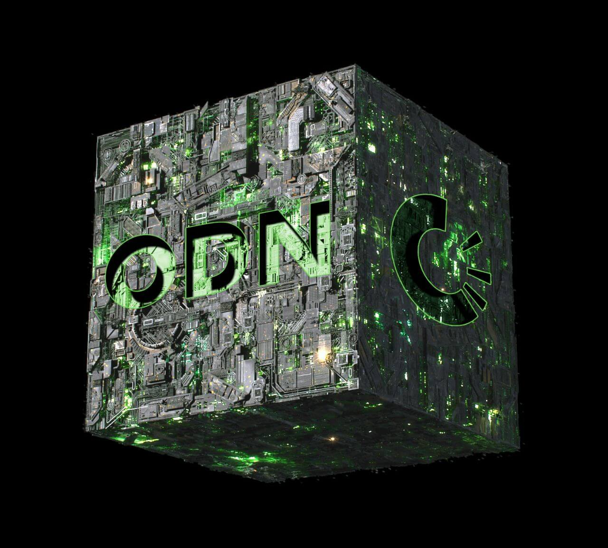

# Core Values

<figure><figcaption></figcaption></figure>

#### The foundation of the OriginTrail protocol rests on three key principle:

## **1. Neutrality**

The first core principle of OriginTrail prioritizes inclusiveness, co-creation, and collaboration with all stakeholders. The protocol aims to maintain compatibility with all data from various sources, including legacy IT systems and new digital systems such as blockchains, by adhering to globally recognized standards such as **GS1** and **W3C**. This is achieved through its open-source and decentralized structure, preventing vendor lock-in, preserving data integrity, and breaking down data silos. OriginTrail applies the principle of neutrality on all levels, including its interoperability between different blockchains, integration with legacy systems through open standards, and allowing users to review the open-source code.

## **2. Usability**

Trace Labs, the developers behind OriginTrail, aim to bring users, enterprises, and developers to the protocol's network by making it more efficient and user-friendly. To achieve this, they have created various interface solutions that are used by **** [**global enterprises and government bodies**](https://origintrail.io/case-studies). They have also developed [**Project Magnify**](https://projectmagnify.io/), a DKG client, which enables users to publish assets directly into the ecosystem without having to operate a node. The improvement in the usability of the ODN will generate positive network effects, leading to growth for the entire ecosystem.

## **3. Inclusiveness**

As the OriginTrail ecosystem expands, Trace Labs must maintain partnerships with global business leaders and communities to meet their requirements. This will drive the team to continue developing technical infrastructure and business models that promote worldwide adoption of the protocol. The team welcomes anyone who wants to build on the DKG and will ensure that all groups are included, striving to maintain value and relevance to the broader community. This aligns with the team's first core value of neutrality, creating a positive virtuous cycle.
