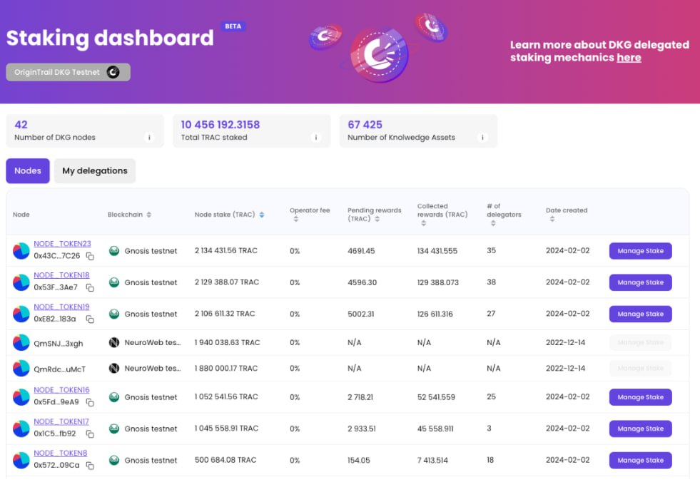

# Staking Instructions


Delegated staking is live on Gnosis mainnet. Delegated staking on NeuroWebAI (formerly known as OriginTrail Parachain) will go live at a later date.&#x20;


## Step 1 - Add Gnosis Network to MetaMask

Begin by adding the Gnosis network to your Metamask extension by either connecting MetaMask to this [**link** ](https://chainlist.org/?search=gnosis)or manually with the info below

| Network name        | Gnosis                                           |
| ------------------- | ------------------------------------------------ |
| **RPC URL**         | [https://1rpc.io/gnosis](https://1rpc.io/gnosis) |
| **Chain ID**        | 100                                              |
| **Currency symbol** | XDAI                                             |

Add xTRAC on MetaMask by importing this contract address

```
0xEddd81E0792E764501AaE206EB432399a0268DB5
```

## Step 2 - Fund your wallet

Begin by obtaining xDAI for operations on Gnosis chain through their [f**aucet**](https://www.gnosisfaucet.com/).&#x20;

If you require more xDAI, you can buy DAI on [**Uniswap**](https://app.uniswap.org/swap) or any exchange and use the [**DAI bridge**](https://bridge.gnosischain.com/) to get xDAI.&#x20;

Since Gnosis is EVM compatible, you can use your Ledger connected to MetaMask for all operations.&#x20;

Once you obtained xDAI, bridge your ERC-20 TRAC from Ethereum to Gnosis by using the [**Omnibridge**](https://omnibridge.gnosischain.com/bridge).


There is no fee for bridging assets to Gnosis other than regular gas fee. However, there is a 0.1% cut on your assets when you bridge assets back to Ethereum from Gnosis.



If your TRAC is currently teleported on NeuroWeb AI (formerly known as OriginTrail parachain), you need to [**teleport**](https://teleport.origintrail.io/) them back to Ethereum before you can stake on Gnosis. You must send your tokens to the teleport contract before the 10th of each month and the teleport will happen on the 15th.&#x20;


## Step 3 - Stake


A node can be fully operational with delegated stake only as long as the total stake amount is 50k TRAC or above. If the node you add your stake to has less than 50k TRAC, it will not be earning any publishes.


Visit the [**staking dashboard**](https://dkg.origintrail.io/staking) and connect to your Metamask.

<figure><figcaption></figcaption></figure>

Select the node to delegate your xTRAC.&#x20;


Note that delegated stake sent to a node will lock your TRAC for 28 days.&#x20;


<figure><figcaption></figcaption></figure>

### You have now successfully staked your xTRAC!&#x20;


### The editor of OriginTrail Deep Dive, BRX, is a long time community admin of OriginTrail and a 3+ year node runner on the network. BRX is also part of team OTHub, an open source community driven project providing network analytics, node statistics and an API to everyone for free. To keep OTHub servers running and to keep providing Deep Dive with the latest content, we appreciate any stake you could delegate to our OTHUB node.

### Contract address: 0xc5D08540bD854910Af9a5FfA53C4996Be8A794EC&#x20;

### Please visit [https://othub.io/staking](https://othub.io/staking) for more details!

